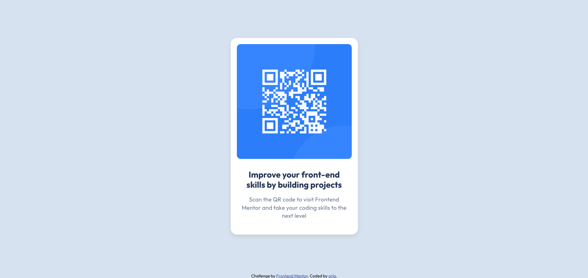

# Frontend Mentor - QR code component solution

This is a solution to the [QR code component challenge on Frontend Mentor](https://www.frontendmentor.io/challenges/qr-code-component-iux_sIO_H). Frontend Mentor challenges help you improve your coding skills by building realistic projects. 

## Table of contents

- [Overview](#overview)
  - [Screenshot](#screenshot)
- [My process](#my-process)
  - [What I learned](#what-i-learned)
  - [Useful resources](#useful-resources)
- [Author](#author)


## Overview

my solution to the Frontend Mentor QR code component challenge

### Screenshot




## My process


### What I learned

-using flexbox for centering

```css
.body {
  display: flex;
  justify-content: center; 
  align-items: center; 
  height: 100vh; 
  margin: 0; 
  flex-direction: column;
}
```

-using Google Fonts

```css
@import url('https://fonts.googleapis.com/css2?family=Outfit:wght@100..900&display=swap');
```


### Useful resources

- [w3schools](https://www.w3schools.com/css/default.asp) - This helped me as I was struggling with some of the styling such as centering items. 


## Author


- Frontend Mentor - [@orla-m](https://www.frontendmentor.io/profile/orla-m)


